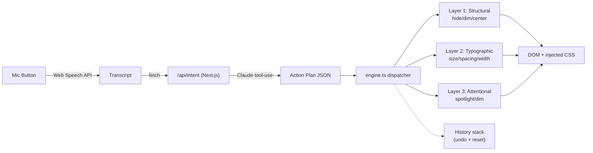

## North Star Demo (the 90-second story)

1. Open the page. It is *aggressively* chaotic — competing reds and yellows, six sidebars worth of recommendations, blinking "Lightning Deals" badges, dense product grids, three nav bars. Let the chaos speak.
2. Narration: "Now imagine you have ADHD or dyslexia. Your eyes can't anchor."
3. Click the floating mic. Say: *"This is too much, I can't focus."*
4. Toast: "Detected overload — simplifying layout and reducing stimulation."
5. Page transforms in ~600ms: sidebars dim out, nav collapses, main content centers and widens its line-height, type scales up, everything except the product the user is reading dims to ~40% opacity.
6. Say: *"Make the text even bigger."* → incremental change applied, prior state preserved.
7. Click "Reset" → back to chaos. Demo loops.

## Scope cuts (what we are NOT building today)

- Diagnostic onboarding flow (replace with a hardcoded default `userProfile`)
- Persistence (no localStorage, no DB)
- Chrome extension shell (engine is written so it *can* be wrapped later)
- Auth, analytics, settings UI beyond Reset + Undo
- Multi-page or multi-site support

## Recommended stack

- **Next.js 14 (App Router) + TypeScript + Tailwind** — single repo, server route for the LLM call hides the API key.
- **Anthropic Claude (Sonnet)** with tool-use / structured output for the intent agent. Single round-trip per voice input.
- **Web Speech API** (`SpeechRecognition`) for STT — zero deps, works in Chrome.
- **No state library** — `useState` + a small in-module store in `engine.ts` is enough.

## Architecture



## File layout

- [app/page.tsx](app/page.tsx) — the chaotic Amazon clone (one big static-ish JSX tree, intentionally messy).
- [app/layout.tsx](app/layout.tsx) — mounts `<MicOverlay />` and `<Toaster />` globally.
- [app/globals.css](app/globals.css) — base styles + utility classes the engine toggles: `.an-hidden`, `.an-dim`, `.an-spotlight`, `.an-reflow-center`, plus CSS variables (`--an-font-scale`, `--an-line-height`, `--an-max-width`) the engine writes to.
- [app/_components/MicOverlay.tsx](app/_components/MicOverlay.tsx) — floating bottom-right mic button, recording state, transcript display, Reset button.
- [app/_components/Toaster.tsx](app/_components/Toaster.tsx) — minimal toast (one slot is fine).
- [app/_lib/engine.ts](app/_lib/engine.ts) — `applyPlan(plan)`, `undoLast()`, `reset()`. Maintains a stack of inverse operations.
- [app/_lib/actions.ts](app/_lib/actions.ts) — action catalog: each action has `apply(args)` returning an `undo()`.
- [app/_lib/llm.ts](app/_lib/llm.ts) — client `requestIntent(transcript)` that POSTs to the API route.
- [app/api/intent/route.ts](app/api/intent/route.ts) — server route, calls Anthropic with the system prompt + transcript + a *short* DOM summary (top-level landmarks only).
- [.env.local](.env.local) — `ANTHROPIC_API_KEY=...`

## The action catalog (ship exactly these for MVP)

Six actions cover ~80% of demo value. Each is one function in [app/_lib/actions.ts](app/_lib/actions.ts):

- **structural**: `hide(selector)`, `dim(selector, opacity)`, `centerMain(selector)`
- **typographic**: `setFontScale(n)`, `setMaxWidth(px)`, `setLineHeight(n)`
- **attentional**: `spotlight(selector)` — adds `.an-spotlight` to one element and `.an-dim` to siblings under a chosen scope.

All actions return an `undo` closure. `engine.ts` pushes them onto a stack so Reset is just `while (stack.length) stack.pop()()`.

## The LLM agent contract

`POST /api/intent` body:

```json
{ "transcript": "this is too much, I can't focus", "domSummary": ["nav.top", "aside.left", "main.product", "aside.right", "footer"] }
```

Response (Claude returns this via tool-use schema we enforce):

```json
{
  "reason_short": "Detected overload — simplifying layout",
  "intensity": 0.7,
  "actions": [
    { "layer": "structural", "type": "hide", "selector": "aside.left" },
    { "layer": "structural", "type": "dim", "selector": "nav.top", "opacity": 0.3 },
    { "layer": "structural", "type": "centerMain", "selector": "main.product" },
    { "layer": "typographic", "type": "setFontScale", "value": 1.2 },
    { "layer": "typographic", "type": "setMaxWidth", "value": 720 },
    { "layer": "attentional", "type": "spotlight", "selector": "main.product" }
  ]
}
```

The system prompt for Claude gives it: the action schema, a small "user profile" (default values for now), and instructions to be *gradual* and *non-destructive* (prefer dim over hide, scale by intensity).

## 3-hour time budget

- **0:00 – 0:25** — `npx create-next-app` (TS + Tailwind), install `@anthropic-ai/sdk`, set `.env.local`, scaffold empty files above.
- **0:25 – 1:25** — build `app/page.tsx`. Spend real time here. Pack in: top promo bar, two stacked navs, left sidebar of categories, main product with a wall of bullets and competing buttons, right sidebar "Customers also bought" carousel, "Lightning Deal" countdown badges, a footer of link soup. Use clashing accent colors. This page selling the "before" state is the demo.
- **1:25 – 2:00** — `actions.ts` + `engine.ts` + the CSS classes in `globals.css`. Wire one action end-to-end manually first, then add the rest.
- **2:00 – 2:35** — `MicOverlay.tsx` (Web Speech API), `/api/intent/route.ts` (Anthropic call with strict tool schema), `llm.ts`. Hardcode a fallback action plan so demo still works if API fails.
- **2:35 – 2:50** — `Toaster.tsx`, smooth CSS transitions on the toggled classes (`transition: all 400ms ease`), Reset button.
- **2:50 – 3:00** — full dry run of the demo script. Fix the one thing that breaks. Stop.

## Risk + mitigation

- **Web Speech API only works in Chrome over HTTPS or localhost.** Demo on localhost or via `vercel dev` — fine.
- **LLM latency / failure on stage.** Add a hardcoded fallback plan keyed on a regex (e.g. transcript matches /too much|overwhelm|focus/) so the demo never dies live.
- **Tailwind purging the engine's dynamic classes.** Add `.an-*` to Tailwind `safelist` in `tailwind.config.ts`.
- **Mic permission popup mid-demo.** Click the mic once before going on stage; the prompt is sticky.

## Stretch (if any time left, in priority order)

1. Incremental refinement — second voice input layers actions instead of resetting.
2. Soft "spotlight" via a `radial-gradient` overlay, not just opacity changes (visually striking).
3. Undo button (one-step).
4. Diagnostic onboarding (3 sliders modal on first load).