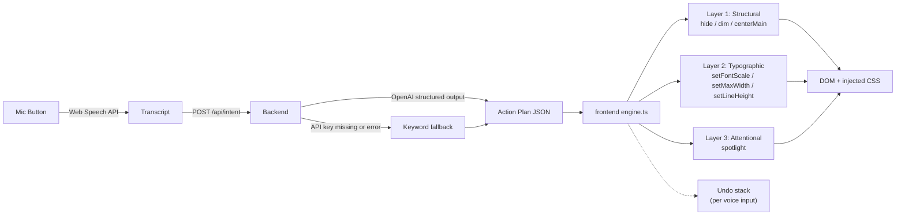

# Adaptive Web — Voice-Controlled Calm Mode

A 3-hour MVP demo: a voice-controlled adaptive UI overlay that calms a chaotic webpage in real time. Built for users with ADHD, dyslexia, and sensory sensitivity.

The demo runs on a hosted web app. The 3-layer engine is written as a portable JS module so it can be wrapped in a Chrome extension later — but the MVP target is a frictionless web demo, not an extension.

## The 90-second demo story

1. Open the page. It is *aggressively* chaotic — clashing colors, six sidebars worth of recommendations, blinking "Lightning Deals", dense product grids, link-soup footers. Let the chaos speak.
2. Narrate: "Now imagine you have ADHD or dyslexia. Your eyes can't anchor."
3. Click the floating mic (bottom right). Say: **"This is too much, I can't focus."**
4. Toast: *"Detected overload — simplifying layout"*.
5. Page transforms in ~600ms: sidebars dim out, nav collapses, main content centers and widens its line-height, type scales up, everything except the product the user is reading dims to ~35% opacity.
6. Say: **"Make the text even bigger."** — incremental change applied, prior state preserved.
7. Click **Reset** → back to chaos. Demo loops.

## Project structure

```
ai-native/
├── README.md
├── package.json              # root: orchestrates dev + tests across both
├── .gitignore
├── backend/                  # Express + TS + OpenAI SDK + Vitest
│   ├── package.json
│   ├── tsconfig.json
│   ├── .env.example          # OPENAI_API_KEY=... + OPENAI_MODEL
│   ├── src/
│   │   ├── index.ts          # server bootstrap
│   │   ├── routes/intent.ts  # POST /api/intent
│   │   ├── lib/
│   │   │   ├── openai.ts     # OpenAI structured-output (json_schema strict)
│   │   │   └── fallback.ts   # keyword-based parser (demo safety net)
│   │   └── types/intent.ts   # shared schema
│   └── __tests__/fallback.test.ts
└── frontend/                 # Vite + React 18 + TS + Tailwind + Vitest
    ├── package.json
    ├── tsconfig.json
    ├── vite.config.ts
    ├── tailwind.config.ts
    ├── postcss.config.js
    ├── index.html
    └── src/
        ├── main.tsx
        ├── App.tsx
        ├── index.css         # tailwind + .an-* utility classes + CSS variables
        ├── pages/ChaoticAmazon.tsx        # the demo's "before" state
        ├── components/
        │   ├── MicOverlay.tsx             # floating mic + Web Speech API
        │   └── Toaster.tsx
        ├── lib/
        │   ├── engine.ts                  # apply / undoLast / reset (stack)
        │   ├── actions.ts                 # 7 actions, each returns its undo
        │   ├── speech.ts                  # Web Speech API wrapper
        │   ├── intentClient.ts            # POST → backend, with offline fallback
        │   └── fallbackIntent.ts          # mirrors backend/lib/fallback.ts
        ├── types/intent.ts                # mirrors backend/src/types/intent.ts
        └── __tests__/
            ├── engine.test.ts
            └── fallbackIntent.test.ts
```

## Quickstart

Prerequisites: Node 20+, Chrome or Edge (Web Speech API).

```powershell
# from repo root, one-time install
npm run install:all

# (optional) configure OpenAI — without this the keyword fallback is used
copy backend\.env.example backend\.env
# then edit backend\.env and set OPENAI_API_KEY=sk-...

# run both backend and frontend together
npm run dev
```

- Frontend: http://localhost:5173
- Backend health: http://localhost:3001/health

If you don't want concurrently, run two terminals:

```powershell
# terminal 1
cd backend; npm run dev

# terminal 2
cd frontend; npm run dev
```

## Tests

```powershell
npm test                          # both packages
npm --prefix frontend test        # frontend only
npm --prefix backend test         # backend only
```

The tests cover:

- **Engine**: every action's apply + undo, the batch stack, reset(), CSS variable restoration, the global `an-active` class, and graceful handling of bad selectors.
- **Fallback intent parser** (frontend + backend): keyword detection, plan merging / dedup, soft default for unknown input, schema validity (only known action types).

## Architecture



### The action contract

Every voice request resolves to a `Plan`:

```ts
{
  reason_short: "Detected overload — simplifying layout",
  intensity: 0.7,
  actions: [
    { layer: "structural",  type: "hide",         selector: "[data-an-role='aside-left']" },
    { layer: "structural",  type: "dim",          selector: "[data-an-role='nav']", opacity: 0.25 },
    { layer: "structural",  type: "centerMain",   selector: "[data-an-role='main']" },
    { layer: "typographic", type: "setFontScale", value: 1.15 },
    { layer: "typographic", type: "setMaxWidth",  value: 720 },
    { layer: "typographic", type: "setLineHeight",value: 1.6 },
    { layer: "attentional", type: "spotlight",    selector: "[data-an-role='main']" }
  ]
}
```

The frontend engine looks up each action in [`actions.ts`](frontend/src/lib/actions.ts), executes it, and pushes the returned `undo` closure onto a stack. `reset()` pops the entire stack in reverse order — the page returns to its exact original state.

### Why `data-an-role` selectors?

Element class names on a real Amazon clone are noisy and brittle. We tag the page with `data-an-role` so:

1. The LLM has a tiny, stable vocabulary of selectors it knows are safe.
2. Restyles don't break the engine.
3. Wrapping the engine in a Chrome extension later just means swapping the page-side tagging for a heuristic that infers roles from `<nav>`, `<main>`, `<aside>`, etc.

### Demo safety: two fallback layers

1. If the backend returns an error or the network is down, the frontend's `intentClient` falls back to its own keyword parser ([`fallbackIntent.ts`](frontend/src/lib/fallbackIntent.ts)) — the demo still works fully offline.
2. If the backend is up but `OPENAI_API_KEY` is unset, the backend itself uses the same keyword parser ([`backend/src/lib/fallback.ts`](backend/src/lib/fallback.ts)).

This is intentional. On stage, an API outage should never kill the demo.

## MVP acceptance criteria

A run is "done" when **all** of these are true:

- [ ] `npm run install:all` completes without errors
- [ ] `npm test` passes (both packages)
- [ ] `npm run dev` starts both servers; backend logs whether it's using LLM or fallback
- [ ] Visiting http://localhost:5173 shows the chaotic Amazon clone
- [ ] Clicking the mic and saying "this is too much" applies a visible transform within ~3 seconds
- [ ] The toast shows the LLM's `reason_short` (or the fallback's)
- [ ] Saying a second phrase ("make it bigger") layers on top — does not reset
- [ ] **Undo** removes the most recent batch only; **Reset** restores the original page exactly
- [ ] Typing into the text input (instead of using the mic) works as a non-voice fallback
- [ ] On a Firefox/no-mic browser, the overlay still loads and the typed-input fallback works

## Demo script (cheat sheet)

| Beat | Action | Expected |
|---|---|---|
| 0 | Page loads | Chaotic Amazon-clone, mic in bottom-right |
| 1 | "There's too much going on" | Sidebars dim, main centers, type scales up, spotlight on product |
| 2 | "Make the text even bigger" | Font scale increases further, prior layout preserved |
| 3 | Click **Reset** | Page returns to chaos |
| 4 | "I can't focus" (alt path) | Periphery dims, spotlight on main, structure mostly preserved |
| 5 | "Even simpler" | Most aggressive flatten — sidebars hidden, narrow column |

## Troubleshooting

- **Mic does nothing**: Web Speech API works in Chrome / Edge over `localhost` or HTTPS. Firefox is not supported. The text input is the universal fallback.
- **Mic permission popup mid-demo**: Click the mic *once* on the demo machine before going on stage. Permission is sticky per-origin.
- **CORS error**: Backend `ALLOWED_ORIGIN` must match the frontend URL. Default is `http://localhost:5173`. Edit `backend/.env`.
- **Tailwind classes missing at runtime**: The engine's `.an-*` classes are listed in `tailwind.config.ts` `safelist` — if you rename them, update both places.
- **LLM returns weird selectors**: The system prompt restricts the model to `[data-an-role='...']` selectors. If you add new page sections, also tag them with `data-an-role`.

## Stretch (post-3-hour, in priority order)

1. Spotlight via `radial-gradient` overlay instead of opacity changes.
2. Undo button → keyboard shortcut (`Ctrl/Cmd-Z`).
3. Diagnostic onboarding (3 sliders modal on first load → persists `userProfile` in `localStorage`, scales every action's intensity).
4. Chrome extension shell (MV3) — content script that auto-tags `<nav>/<main>/<aside>` with `data-an-role` and reuses the same engine.
5. Streaming partial transcripts so the page starts adapting before the user finishes speaking.
