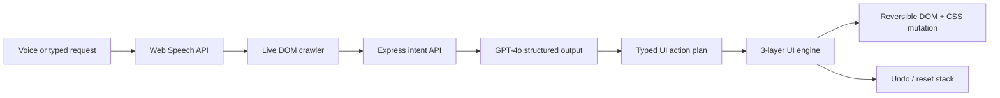

# Percept

Percept is a voice-controlled adaptive interface layer for cognitive accessibility. It lets a user look at a chaotic webpage and say things like:

- "This is too much."
- "Make the reviews bigger."
- "Hide the sidebars."
- "Make it easier to read."

Percept turns that natural-language request into a structured UI action plan, applies it directly to the webpage, explains what it changed, and lets the user undo or reset everything safely.

The demo is built around intentionally overwhelming ecommerce and news pages, but the underlying methodology is portable: Percept crawls the live DOM, grounds an LLM in real page elements, and applies reversible CSS/DOM transformations through a 3-layer adaptive UI engine.

## Inspiration

Modern websites are optimized for conversion, not cognition. Ecommerce pages, news pages, dashboards, and social feeds all compete for attention with sidebars, carousels, ads, recommendations, banners, dense typography, and motion.

For many neurodivergent users — including people with ADHD, dyslexia, sensory sensitivity, or cognitive fatigue — the problem is not that the content is unavailable. The problem is that the interface makes it too expensive to process.

Percept asks a different question:

> What if the webpage could adapt to the user's perceptual needs in real time?

Instead of forcing users to hunt through settings or install rigid reader modes, Percept gives them a small voice interface and lets them describe what they need in plain language.

## What it does

Percept sits in the bottom-right corner of the page as a persistent overlay. The user can complete a short visual calibration, then speak or type a request. Percept sends that request, along with a live catalog of the page's DOM elements, to an LLM agent. The agent returns a typed action plan, and the frontend engine applies those changes across three layers:

### 1. Structural layer

Reflows the page by dimming or hiding sidebars, collapsing clutter, centering the main content, and removing peripheral distractions.

### 2. Typographic layer

Improves readability through font scaling, line height, letter spacing, max-width control, background changes, and cleaner font options.

### 3. Attentional layer

Guides focus with soft spotlighting and ambient dimming so the current task or content region visually wins over the rest of the page.

Every change is reversible. Percept tracks applied actions in an undo stack and can reset the page back to its original state.

## How we built it

Percept is a TypeScript monorepo with a React/Vite frontend and an Express backend.

### Frontend

The frontend is built with React 18, Vite, TypeScript, and Tailwind CSS. It contains:

- `MicOverlay.tsx` — the Percept voice/text control panel.
- `DiagnosticModal.tsx` — the visual calibration flow.
- `domCrawler.ts` — a live DOM crawler that creates a catalog of targetable page elements.
- `speech.ts` — a Web Speech API wrapper with continuous recognition and custom silence detection.
- `actions.ts` — the transformation action catalog.
- `engine.ts` — the reversible action stack and pub-sub state layer.

### Backend

The backend is a TypeScript Express API with OpenAI integration:

- `POST /api/intent` receives the user transcript, page element catalog, and user profile.
- `openai.ts` calls GPT-4o using strict JSON-schema structured outputs.
- The returned plan is guaranteed to match our action schema before it reaches the DOM engine.

## Technical architecture



## The LLM agent

The LLM is not free-writing JavaScript. It is constrained to a strict JSON schema. Every response must include:

- `reason_short` — a concise user-facing explanation.
- `reasoning` — a short explanation of how the model interpreted the request.
- `intensity` — a numeric adaptation strength.
- `actions` — an array of typed UI actions.

Example action:

```ts
{
  layer: "typographic",
  type: "scaleElement",
  selector: "[data-an-id='product-reviews']",
  value: 1.4,
  opacity: null,
  color: null
}
```

The model receives a catalog of real page elements before every request, so it can choose from known selectors instead of hallucinating DOM targets.

## Personalization

Percept includes a short visual diagnostic that builds a lightweight perceptual profile:

- Density tolerance
- Text scale preference
- Contrast preference
- Reading chunking preference
- Focus style

That profile is used in two places:

1. It is sent to the LLM so the model can reason with the user's needs in mind.
2. It post-processes the returned action plan on the client, scaling font sizes, dimming intensity, and focus behavior.

This means the same request can produce different UI adaptations for different users.

## Challenges we ran into

### Getting the LLM to produce reliable UI changes

Early versions asked the model to infer selectors directly. That was fragile. The fix was to crawl the DOM first, send the model a verified element catalog, and force the response through a strict JSON schema.

### Avoiding destructive page changes

We wanted the page to adapt without breaking. Each engine action returns an undo closure that restores the exact previous state. Reset unwinds the whole stack.

### Protecting the Percept overlay

Once the engine could dim, scale, and reflow the page, we needed to make sure it never changed the control panel itself. The overlay and toast are protected roles and are filtered out of every action selector.

### Speech timing

The browser's default speech recognition often stops too early. We switched to continuous/interim recognition and added our own silence timer so users can pause mid-thought without being cut off.

### Demo reliability

During development, CORS and port conflicts caused failed LLM calls to fall back silently. We added stricter dev server ports, more permissive localhost CORS in development, and visible UI states so users can tell whether the LLM or fallback path handled a request.

## Accomplishments we're proud of

- A real voice-to-LLM-to-DOM pipeline that visibly changes the page.
- Strict structured outputs from GPT-4o instead of brittle natural-language parsing.
- A reversible UI engine with undo and reset.
- A live DOM crawler that makes the LLM page-aware.
- Personalized adaptations based on a visual diagnostic.
- A transparent reasoning panel that shows how the agent interpreted the user's request.
- A design that can move from hosted demo to browser extension without rewriting the core engine.

## What we learned

Accessibility tools need to be adaptable, but they also need to be trustworthy. A user should always know what changed, why it changed, and how to undo it.

We also learned that LLMs become much more useful for interface control when they are grounded in the live DOM and constrained to a typed action space. The model should decide intent and planning — not invent arbitrary code.

## Built with

- React
- TypeScript
- Vite
- Tailwind CSS
- Node.js
- Express
- OpenAI GPT-4o
- Web Speech API
- Vitest

